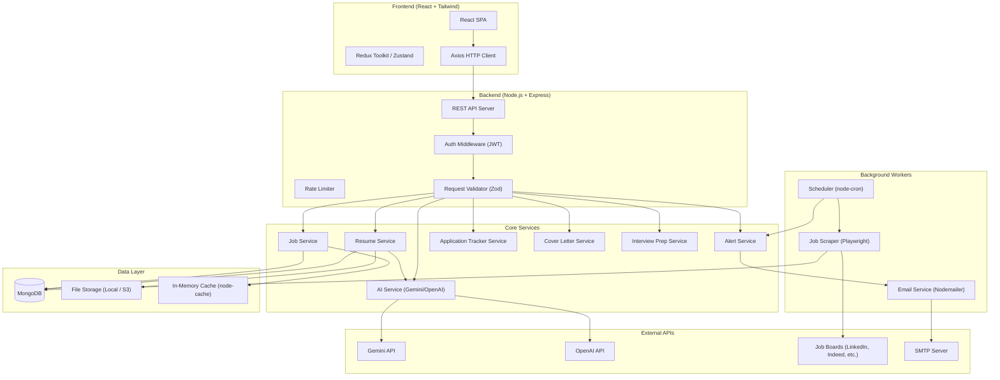
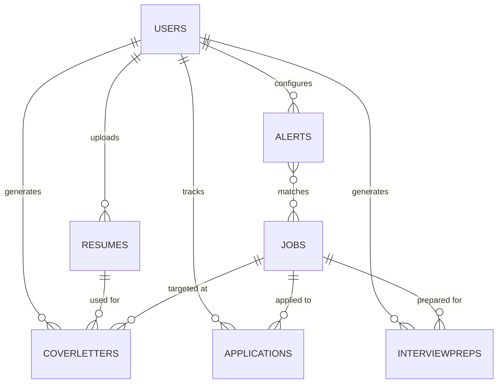
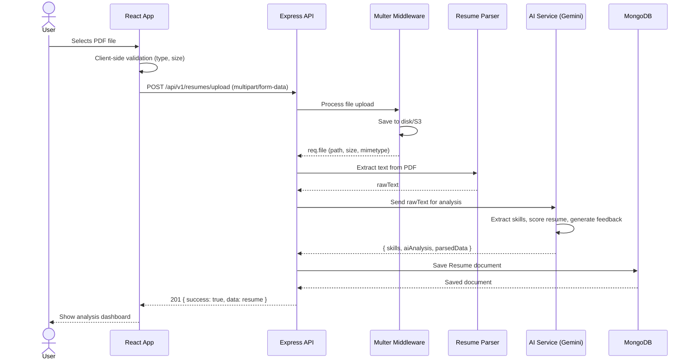
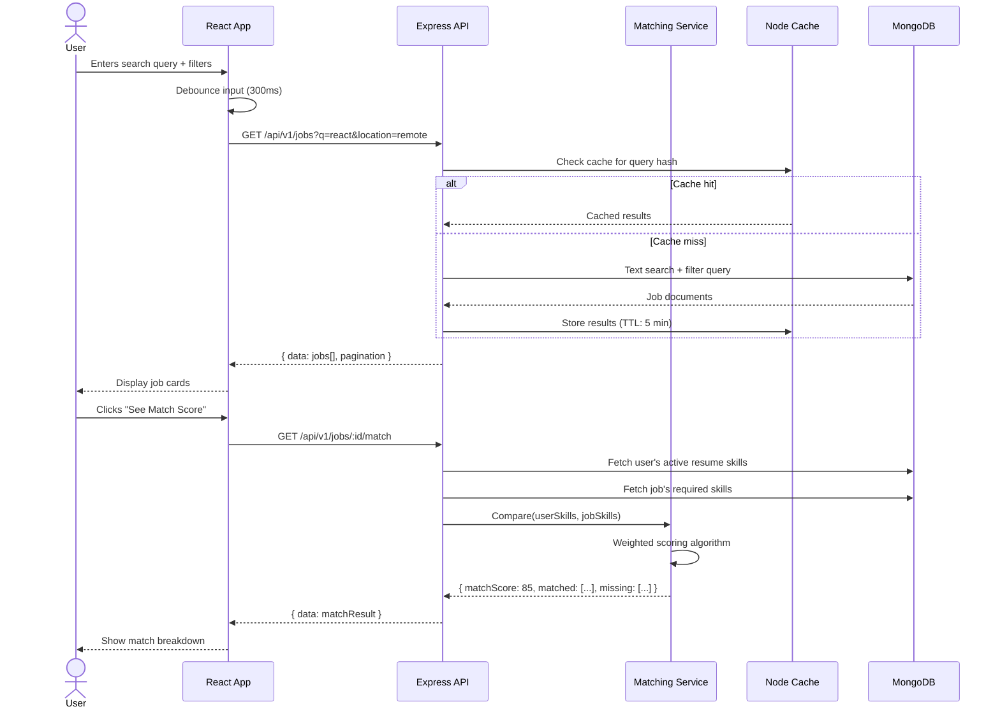
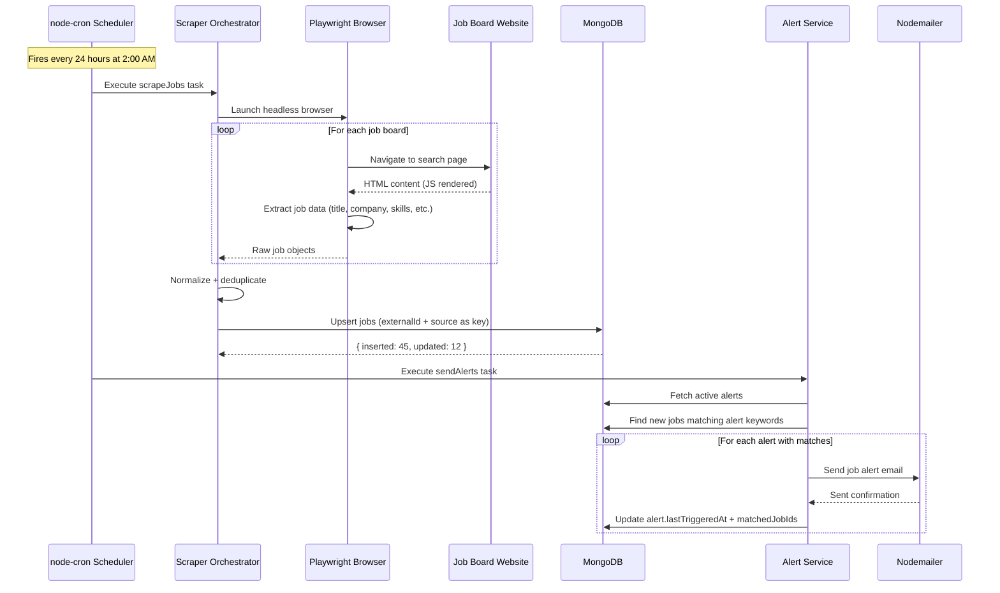
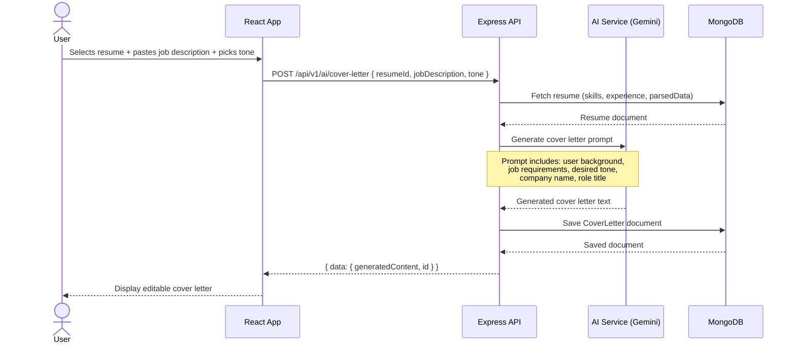

# CareerPilot AI — Complete System Architecture

## 1. System Architecture Overview

CareerPilot AI is a **three-tier, service-oriented monolith** with an event-driven job-aggregation pipeline running alongside the main API server.



### Key Architectural Decisions

| Decision | Choice | Rationale |
|---|---|---|
| Architecture style | Service-oriented monolith | Simpler deployment; split to microservices later if needed |
| API style | RESTful JSON | Industry standard, easy to consume from React |
| Auth | JWT (access + refresh tokens) | Stateless, scalable, supports mobile clients later |
| AI provider | Gemini API (primary), OpenAI (fallback) | Cost-effective; fallback ensures reliability |
| Job scraping | Playwright + node-cron | Headless browser handles JS-rendered job boards |
| File uploads | Multer → local disk (dev) / S3 (prod) | Resume PDFs need persistent, secure storage |
| Validation | Zod schemas | Type-safe, composable, works on both client and server |

---

## 2. Development Phases

### Phase 1 — Foundation (Week 1–2)
> Project scaffolding, authentication, and basic user management

- Initialize monorepo structure (`/client`, `/server`)
- Set up Express server with middleware pipeline
- Configure MongoDB connection with Mongoose
- Implement User model + JWT auth (register, login, refresh, logout)
- Set up React app with routing, auth context, protected routes
- Build Login, Register, and Dashboard shell pages
- Configure environment variables, ESLint, Prettier

### Phase 2 — Resume Engine (Week 3–4)
> Resume upload, parsing, AI analysis, and skill extraction

- Build file upload API (Multer) with validation (PDF/DOCX, size limits)
- Integrate a PDF parser (`pdf-parse`) to extract raw text
- Build AI Service module — send resume text to Gemini API for:
  - Structured skill extraction (technical, soft, tools)
  - Resume scoring (ATS compatibility, content quality)
  - Improvement suggestions
- Store parsed resume data + AI analysis in MongoDB
- Build Resume Upload and Resume Analysis UI pages

### Phase 3 — Job Aggregator (Week 5–6)
> Playwright scraper, scheduled collection, job database

- Build Playwright scraper modules for target job boards
- Implement node-cron scheduler for every-24-hour scraping
- Design Job schema with TTL index (auto-expire after 7 days)
- Build deduplication logic (URL-based + title+company hashing)
- Create Job Search API with filters (title, location, remote, skills)
- Build Job Listings and Job Detail UI pages

### Phase 4 — Smart Matching & Recommendations (Week 7–8)
> AI-powered job-to-resume matching and personalized recommendations

- Build matching engine: compare user skills vs. job requirements
- Calculate match scores using weighted skill overlap + AI semantic matching
- Build recommendation API: return top-N jobs ranked by match score
- Create "Recommended Jobs" and "Match Analysis" UI components

### Phase 5 — AI Tools (Week 9–10)
> Cover letter generation, interview question generation

- Build Cover Letter Generator:
  - Input: resume data + job description
  - AI generates tailored cover letter
  - Allow tone/style customization
- Build Interview Question Generator:
  - Input: job description + user skills
  - AI generates role-specific questions with model answers
- Build corresponding UI pages with copy/download/export

### Phase 6 — Application Tracker & Alerts (Week 11–12)
> Kanban-style tracker, email alerts, job notifications

- Build Application model (status: Applied → Phone Screen → Interview → Offer → Rejected)
- Build CRUD API for applications with status transitions
- Build Kanban board UI with drag-and-drop
- Set up Nodemailer with SMTP config
- Build alert preferences (keywords, locations, frequency)
- Implement cron job: match new jobs against alert preferences → send emails

### Phase 7 — Polish & Production (Week 13–14)
> Testing, performance, deployment, monitoring

- Write integration tests (Jest + Supertest)
- Write E2E tests (Playwright)
- Add rate limiting, request logging, error tracking
- Optimize MongoDB queries (indexes, aggregation pipelines)
- Dockerize the application
- Set up CI/CD pipeline
- Deploy (Railway / Render / AWS)

---

## 3. Folder Structure

```
careerlens/
├── client/                          # React frontend
│   ├── public/
│   │   ├── index.html
│   │   └── favicon.ico
│   ├── src/
│   │   ├── api/                     # API client modules
│   │   │   ├── axiosInstance.js      # Axios config (baseURL, interceptors)
│   │   │   ├── authApi.js           # Auth endpoints
│   │   │   ├── resumeApi.js         # Resume endpoints
│   │   │   ├── jobApi.js            # Job endpoints
│   │   │   ├── applicationApi.js    # Application tracker endpoints
│   │   │   ├── aiApi.js             # AI tool endpoints
│   │   │   └── alertApi.js          # Alert preference endpoints
│   │   ├── assets/                  # Static assets (images, icons, fonts)
│   │   ├── components/              # Reusable UI components
│   │   │   ├── common/              # Buttons, Inputs, Modals, Loaders
│   │   │   ├── layout/              # Navbar, Sidebar, Footer, PageWrapper
│   │   │   ├── resume/              # ResumeUploader, SkillTag, ScoreCard
│   │   │   ├── jobs/                # JobCard, JobFilter, JobList
│   │   │   ├── applications/        # KanbanBoard, ApplicationCard, StatusBadge
│   │   │   └── ai/                  # CoverLetterForm, InterviewQList
│   │   ├── context/                 # React Context providers
│   │   │   ├── AuthContext.jsx      # Auth state, login/logout handlers
│   │   │   └── ThemeContext.jsx     # Dark/light mode
│   │   ├── hooks/                   # Custom React hooks
│   │   │   ├── useAuth.js           # Auth hook
│   │   │   ├── useFetch.js          # Generic data fetching hook
│   │   │   └── useDebounce.js       # Input debounce hook
│   │   ├── pages/                   # Page-level components (one per route)
│   │   │   ├── Home.jsx
│   │   │   ├── Login.jsx
│   │   │   ├── Register.jsx
│   │   │   ├── Dashboard.jsx
│   │   │   ├── ResumeUpload.jsx
│   │   │   ├── ResumeAnalysis.jsx
│   │   │   ├── JobSearch.jsx
│   │   │   ├── JobDetail.jsx
│   │   │   ├── Recommendations.jsx
│   │   │   ├── CoverLetterGenerator.jsx
│   │   │   ├── InterviewPrep.jsx
│   │   │   ├── ApplicationTracker.jsx
│   │   │   ├── AlertSettings.jsx
│   │   │   └── Profile.jsx
│   │   ├── routes/                  # Route definitions
│   │   │   ├── AppRoutes.jsx        # All route declarations
│   │   │   └── ProtectedRoute.jsx   # Auth guard wrapper
│   │   ├── store/                   # State management (if using Redux/Zustand)
│   │   │   ├── slices/
│   │   │   │   ├── authSlice.js
│   │   │   │   ├── resumeSlice.js
│   │   │   │   └── jobSlice.js
│   │   │   └── store.js
│   │   ├── utils/                   # Frontend utilities
│   │   │   ├── constants.js         # App-wide constants
│   │   │   ├── formatters.js        # Date, currency, text formatters
│   │   │   └── validators.js        # Client-side form validation
│   │   ├── styles/                  # Global styles
│   │   │   └── globals.css          # Tailwind directives + custom CSS
│   │   ├── App.jsx                  # Root component
│   │   └── main.jsx                 # Entry point (ReactDOM.render)
│   ├── tailwind.config.js
│   ├── postcss.config.js
│   ├── vite.config.js
│   └── package.json
│
├── server/                          # Express backend
│   ├── src/
│   │   ├── config/                  # Configuration modules
│   │   │   ├── db.js                # MongoDB connection
│   │   │   ├── env.js               # Environment variable loader + validation
│   │   │   ├── cors.js              # CORS configuration
│   │   │   ├── logger.js            # Winston/Pino logger setup
│   │   │   └── ai.js                # AI provider config (API keys, models)
│   │   ├── controllers/             # Request handlers (thin — delegate to services)
│   │   │   ├── authController.js
│   │   │   ├── userController.js
│   │   │   ├── resumeController.js
│   │   │   ├── jobController.js
│   │   │   ├── applicationController.js
│   │   │   ├── coverLetterController.js
│   │   │   ├── interviewController.js
│   │   │   └── alertController.js
│   │   ├── middleware/              # Express middleware
│   │   │   ├── authMiddleware.js    # JWT verification
│   │   │   ├── errorHandler.js      # Global error handler
│   │   │   ├── rateLimiter.js       # Rate limiting (express-rate-limit)
│   │   │   ├── upload.js            # Multer config for file uploads
│   │   │   └── validate.js          # Zod schema validation middleware
│   │   ├── models/                  # Mongoose schemas/models
│   │   │   ├── User.js
│   │   │   ├── Resume.js
│   │   │   ├── Job.js
│   │   │   ├── Application.js
│   │   │   ├── CoverLetter.js
│   │   │   ├── InterviewPrep.js
│   │   │   └── Alert.js
│   │   ├── routes/                  # Express route definitions
│   │   │   ├── index.js             # Route aggregator
│   │   │   ├── authRoutes.js
│   │   │   ├── userRoutes.js
│   │   │   ├── resumeRoutes.js
│   │   │   ├── jobRoutes.js
│   │   │   ├── applicationRoutes.js
│   │   │   ├── coverLetterRoutes.js
│   │   │   ├── interviewRoutes.js
│   │   │   └── alertRoutes.js
│   │   ├── services/                # Business logic layer
│   │   │   ├── authService.js       # Register, login, token management
│   │   │   ├── resumeService.js     # Parse, store, retrieve resumes
│   │   │   ├── jobService.js        # Job CRUD, search, filtering
│   │   │   ├── matchingService.js   # Skill matching + scoring engine
│   │   │   ├── aiService.js         # AI provider abstraction layer
│   │   │   ├── coverLetterService.js
│   │   │   ├── interviewService.js
│   │   │   ├── applicationService.js
│   │   │   ├── alertService.js      # Alert matching + notification dispatch
│   │   │   └── emailService.js      # Nodemailer email sending
│   │   ├── jobs/                    # Background jobs & scrapers
│   │   │   ├── scheduler.js         # node-cron job registry
│   │   │   ├── scrapers/
│   │   │   │   ├── baseScraper.js   # Abstract scraper class
│   │   │   │   ├── linkedinScraper.js
│   │   │   │   ├── indeedScraper.js
│   │   │   │   └── index.js         # Scraper orchestrator
│   │   │   └── tasks/
│   │   │       ├── scrapeJobs.js    # Orchestrate all scrapers
│   │   │       ├── sendAlerts.js    # Match new jobs → send emails
│   │   │       └── cleanupJobs.js   # Remove expired/stale job listings
│   │   ├── utils/                   # Shared utilities
│   │   │   ├── AppError.js          # Custom error class
│   │   │   ├── asyncHandler.js      # Async route error wrapper
│   │   │   ├── tokenUtils.js        # JWT sign/verify helpers
│   │   │   ├── resumeParser.js      # PDF/DOCX text extraction
│   │   │   ├── skillExtractor.js    # Regex + dictionary-based pre-filter
│   │   │   └── matchScorer.js       # Weighted skill match algorithm
│   │   ├── validators/              # Zod validation schemas
│   │   │   ├── authValidator.js
│   │   │   ├── resumeValidator.js
│   │   │   ├── jobValidator.js
│   │   │   ├── applicationValidator.js
│   │   │   └── alertValidator.js
│   │   └── app.js                   # Express app setup (middleware, routes)
│   ├── server.js                    # Entry point (listen on port)
│   ├── package.json
│   └── .env.example
│
├── shared/                          # Shared code between client & server
│   ├── constants/
│   │   ├── skillTaxonomy.js         # Master skill list + categories
│   │   ├── jobCategories.js         # Industry/role categories
│   │   └── applicationStatuses.js   # Status enum + transitions
│   └── types/                       # Shared type definitions (JSDoc/TS)
│       └── index.js
│
├── scripts/                         # Dev/ops scripts
│   ├── seedDb.js                    # Seed database with sample data
│   └── testScraper.js               # Manual scraper test runner
│
├── .gitignore
├── .env.example
├── docker-compose.yml               # MongoDB + app containers
├── README.md
└── package.json                     # Root package.json (workspace scripts)
```

---

## 4. Folder & File Responsibilities

### Frontend (`client/`)

| Folder/File | Responsibility |
|---|---|
| `api/` | **API client layer.** Each file wraps Axios calls for a specific domain. `axiosInstance.js` configures the base URL, attaches JWT tokens via interceptors, and handles 401 refresh logic. |
| `assets/` | Static files — images, SVGs, fonts. Imported directly into components. |
| `components/common/` | **Atomic UI components** — Buttons, Inputs, Modals, Spinners, Toast notifications. Zero business logic. Purely presentational + reusable. |
| `components/layout/` | **Layout shells** — Navbar, Sidebar, Footer, PageWrapper. Controls the overall page structure and navigation. |
| `components/resume/` | **Resume-specific components** — `ResumeUploader` (drag-and-drop zone), `SkillTag` (skill chips), `ScoreCard` (analysis results display). |
| `components/jobs/` | **Job listing components** — `JobCard` (summary card), `JobFilter` (search/filter panel), `JobList` (paginated list container). |
| `components/applications/` | **Tracker components** — `KanbanBoard` (drag-and-drop columns), `ApplicationCard` (individual application), `StatusBadge` (status indicator). |
| `components/ai/` | **AI tool components** — `CoverLetterForm` (input form + generated output), `InterviewQList` (question list with expandable answers). |
| `context/` | **React Context providers** for global state that doesn't need Redux — Auth state, theme preferences. |
| `hooks/` | **Custom hooks** — `useAuth` (access auth context), `useFetch` (SWR-like data fetching with loading/error states), `useDebounce` (delay search input). |
| `pages/` | **Page components** — one per route. Each page composes layout + feature components. Handles data fetching via hooks/API modules. |
| `routes/` | **Routing config** — `AppRoutes.jsx` declares all routes with lazy loading. `ProtectedRoute.jsx` wraps authenticated routes and redirects to login. |
| `store/` | **Global state management** — Redux Toolkit slices or Zustand stores for cross-page state (auth, resume data, job search state). |
| `utils/` | **Frontend utilities** — constants, date/currency formatters, client-side validators. |
| `styles/globals.css` | Tailwind directives (`@tailwind base/components/utilities`) + custom CSS variables for theming. |

### Backend (`server/`)

| Folder/File | Responsibility |
|---|---|
| `config/` | **Configuration modules.** Each file exports a configured instance: `db.js` (Mongoose connection with retry logic), `env.js` (validates required env vars at startup using Zod), `logger.js` (structured JSON logging), `ai.js` (AI provider client initialization). |
| `controllers/` | **Request handlers.** Thin functions that: (1) extract validated data from `req`, (2) call the appropriate service, (3) send the response. No business logic lives here. |
| `middleware/` | **Express middleware.** `authMiddleware.js` (decode JWT, attach `req.user`), `errorHandler.js` (catch-all error formatter), `rateLimiter.js` (per-route rate limits), `upload.js` (Multer disk/S3 storage config), `validate.js` (generic Zod validation middleware factory). |
| `models/` | **Mongoose schemas + models.** Define document structure, indexes, virtuals, instance methods, and pre/post hooks. Each file exports a single model. |
| `routes/` | **Route definitions.** Each file defines routes for one resource with middleware chain: `router.post('/upload', auth, upload, validate(schema), controller.upload)`. `index.js` mounts all route files under their prefix. |
| `services/` | **Business logic.** The core of the application. Services are called by controllers and call models + external APIs. `aiService.js` is a **facade** that abstracts Gemini/OpenAI behind a unified interface. |
| `jobs/scrapers/` | **Playwright scraper modules.** `baseScraper.js` defines the abstract interface (navigate, extract, transform). Each concrete scraper extends it for a specific job board. `index.js` orchestrates running all scrapers in parallel. |
| `jobs/tasks/` | **Cron task definitions.** Each file is a self-contained async function that the scheduler calls. `scrapeJobs.js` runs all scrapers, `sendAlerts.js` matches new jobs against user alerts, `cleanupJobs.js` removes expired listings. |
| `jobs/scheduler.js` | **Cron registry.** Registers all tasks with `node-cron` schedules. Runs on server startup. |
| `utils/` | **Shared utilities.** `AppError` (custom error class with status codes), `asyncHandler` (wraps async routes to catch errors), `tokenUtils` (JWT sign/verify), `resumeParser` (extract text from PDF/DOCX), `matchScorer` (skill matching algorithm). |
| `validators/` | **Zod schemas.** One file per resource. Used by the `validate` middleware to validate request body/params/query. |
| `app.js` | **Express app assembly.** Mounts all middleware in order (CORS, body parser, rate limiter, routes, error handler). Does NOT call `.listen()`. |
| `server.js` | **Entry point.** Imports `app.js`, connects to DB, starts the cron scheduler, then calls `app.listen()`. Clean separation for testing. |

### Shared (`shared/`)

| File | Responsibility |
|---|---|
| `skillTaxonomy.js` | Master list of ~500 recognized skills organized by category (Languages, Frameworks, Databases, DevOps, Soft Skills). Used by both the skill extractor (backend) and skill tag display (frontend). |
| `jobCategories.js` | Industry verticals and role categories for job classification. |
| `applicationStatuses.js` | Enum of application statuses + valid transitions (state machine definition). |

---

## 5. Database Design (MongoDB Collections)

### 5.1 `users`

```javascript
{
  _id: ObjectId,
  firstName: String,             // required
  lastName: String,              // required
  email: String,                 // required, unique, indexed
  password: String,              // bcrypt hashed
  avatar: String,                // URL to profile image
  headline: String,              // "Senior Frontend Developer"
  location: {
    city: String,
    state: String,
    country: String
  },
  preferences: {
    desiredRoles: [String],      // ["Frontend Developer", "Full Stack"]
    desiredLocations: [String],  // ["Remote", "New York"]
    salaryRange: {
      min: Number,
      max: Number,
      currency: String           // "USD"
    },
    jobType: [String],           // ["full-time", "contract"]
    remotePreference: String     // "remote" | "hybrid" | "onsite" | "any"
  },
  refreshToken: String,          // hashed refresh token
  isEmailVerified: Boolean,
  lastLoginAt: Date,
  createdAt: Date,               // Mongoose timestamps
  updatedAt: Date
}

// Indexes:
// { email: 1 } — unique
```

### 5.2 `resumes`

```javascript
{
  _id: ObjectId,
  userId: ObjectId,               // ref: users, indexed
  fileName: String,               // "john_doe_resume.pdf"
  fileUrl: String,                // storage path or S3 URL
  fileSize: Number,               // bytes
  mimeType: String,               // "application/pdf"
  rawText: String,                // extracted plain text
  parsedData: {
    name: String,
    email: String,
    phone: String,
    summary: String,
    experience: [{
      title: String,
      company: String,
      location: String,
      startDate: Date,
      endDate: Date,
      current: Boolean,
      description: String
    }],
    education: [{
      degree: String,
      institution: String,
      graduationDate: Date,
      gpa: Number
    }],
    certifications: [String],
    projects: [{
      name: String,
      description: String,
      technologies: [String],
      url: String
    }]
  },
  skills: {
    technical: [String],          // ["React", "Node.js", "PostgreSQL"]
    soft: [String],               // ["Leadership", "Communication"]
    tools: [String],              // ["Git", "Docker", "AWS"]
    languages: [String]           // ["English", "Spanish"]
  },
  aiAnalysis: {
    overallScore: Number,         // 0–100
    atsScore: Number,             // ATS compatibility score
    sections: {
      summary: { score: Number, feedback: String },
      experience: { score: Number, feedback: String },
      skills: { score: Number, feedback: String },
      education: { score: Number, feedback: String },
      formatting: { score: Number, feedback: String }
    },
    strengths: [String],
    improvements: [String],
    keywords: {
      present: [String],
      missing: [String]           // commonly expected but missing
    }
  },
  isActive: Boolean,              // user's primary resume
  version: Number,                // resume version counter
  createdAt: Date,
  updatedAt: Date
}

// Indexes:
// { userId: 1, isActive: 1 }
// { userId: 1, createdAt: -1 }
```

### 5.3 `jobs`

```javascript
{
  _id: ObjectId,
  externalId: String,            // unique ID from source site
  source: String,                // "linkedin" | "indeed" | "glassdoor"
  sourceUrl: String,             // original listing URL
  title: String,                 // indexed (text)
  company: {
    name: String,                // indexed
    logo: String,
    url: String
  },
  location: {
    city: String,
    state: String,
    country: String,
    isRemote: Boolean            // indexed
  },
  description: String,           // full job description (text indexed)
  requirements: [String],        // bullet-point requirements
  responsibilities: [String],
  skills: [String],              // extracted/normalized skills (indexed)
  salary: {
    min: Number,
    max: Number,
    currency: String,
    period: String               // "yearly" | "monthly" | "hourly"
  },
  jobType: String,               // "full-time" | "part-time" | "contract" | "internship"
  experienceLevel: String,       // "entry" | "mid" | "senior" | "lead" | "executive"
  postedAt: Date,                // when the job was posted (indexed)
  scrapedAt: Date,               // when we scraped it
  expiresAt: Date,               // TTL index — auto-delete after 7 days
  isActive: Boolean,
  createdAt: Date,
  updatedAt: Date
}

// Indexes:
// { externalId: 1, source: 1 } — unique compound (deduplication)
// { title: "text", description: "text", "company.name": "text" } — full-text search
// { skills: 1 }
// { postedAt: -1 }
// { expiresAt: 1 } — TTL index (expireAfterSeconds: 0)
// { "location.isRemote": 1, jobType: 1 }
```

### 5.4 `applications`

```javascript
{
  _id: ObjectId,
  userId: ObjectId,              // ref: users, indexed
  jobId: ObjectId,               // ref: jobs (nullable — job may expire)
  jobSnapshot: {                 // snapshot at time of application
    title: String,
    company: String,
    location: String,
    sourceUrl: String
  },
  status: String,                // "saved" | "applied" | "phone_screen" |
                                 // "interview" | "offer" | "rejected" | "withdrawn"
  appliedAt: Date,
  resumeId: ObjectId,            // which resume version was used
  coverLetterId: ObjectId,       // ref: coverLetters (if generated)
  notes: String,                 // user's private notes
  statusHistory: [{
    status: String,
    changedAt: Date,
    note: String
  }],
  nextFollowUp: Date,            // reminder date
  contacts: [{                   // people at the company
    name: String,
    role: String,
    email: String,
    linkedIn: String
  }],
  matchScore: Number,            // skill match % at time of application
  createdAt: Date,
  updatedAt: Date
}

// Indexes:
// { userId: 1, status: 1 }
// { userId: 1, createdAt: -1 }
// { userId: 1, jobId: 1 } — unique compound (prevent duplicate applications)
```

### 5.5 `coverletters`

```javascript
{
  _id: ObjectId,
  userId: ObjectId,              // ref: users, indexed
  resumeId: ObjectId,            // ref: resumes
  jobId: ObjectId,               // ref: jobs (nullable)
  jobDescription: String,        // input job description (if no jobId)
  companyName: String,
  roleName: String,
  tone: String,                  // "professional" | "enthusiastic" | "concise"
  generatedContent: String,      // the AI-generated cover letter
  editedContent: String,         // user's edited version (if modified)
  aiModel: String,               // which model generated it
  promptTokens: Number,          // usage tracking
  completionTokens: Number,
  createdAt: Date,
  updatedAt: Date
}

// Indexes:
// { userId: 1, createdAt: -1 }
```

### 5.6 `interviewpreps`

```javascript
{
  _id: ObjectId,
  userId: ObjectId,              // ref: users, indexed
  jobId: ObjectId,               // ref: jobs (nullable)
  jobTitle: String,
  companyName: String,
  jobDescription: String,
  questions: [{
    category: String,            // "behavioral" | "technical" | "situational" | "role-specific"
    question: String,
    suggestedAnswer: String,
    difficulty: String,          // "easy" | "medium" | "hard"
    tips: [String]
  }],
  userSkills: [String],          // skills used to generate questions
  aiModel: String,
  createdAt: Date,
  updatedAt: Date
}

// Indexes:
// { userId: 1, createdAt: -1 }
```

### 5.7 `alerts`

```javascript
{
  _id: ObjectId,
  userId: ObjectId,              // ref: users, indexed
  name: String,                  // "React Remote Jobs"
  keywords: [String],            // ["react", "frontend", "remote"]
  locations: [String],           // ["Remote", "San Francisco"]
  jobTypes: [String],            // ["full-time"]
  experienceLevels: [String],    // ["mid", "senior"]
  minSalary: Number,
  frequency: String,             // "instant" | "daily" | "weekly"
  isActive: Boolean,
  lastTriggeredAt: Date,
  matchedJobIds: [ObjectId],     // jobs already sent (prevent duplicates)
  createdAt: Date,
  updatedAt: Date
}

// Indexes:
// { userId: 1, isActive: 1 }
// { isActive: 1, frequency: 1 } — for cron query efficiency
```

### Entity Relationship Diagram



---

## 6. API Structure

### Base URL: `/api/v1`

### 6.1 Authentication

| Method | Endpoint | Description | Auth |
|---|---|---|---|
| POST | `/auth/register` | Create account | ✗ |
| POST | `/auth/login` | Login, receive tokens | ✗ |
| POST | `/auth/refresh` | Refresh access token | ✗ (refresh token in cookie) |
| POST | `/auth/logout` | Invalidate refresh token | ✓ |
| POST | `/auth/forgot-password` | Send password reset email | ✗ |
| POST | `/auth/reset-password/:token` | Reset password | ✗ |

### 6.2 User Profile

| Method | Endpoint | Description | Auth |
|---|---|---|---|
| GET | `/users/me` | Get current user profile | ✓ |
| PATCH | `/users/me` | Update profile | ✓ |
| PATCH | `/users/me/preferences` | Update job preferences | ✓ |
| DELETE | `/users/me` | Delete account | ✓ |

### 6.3 Resumes

| Method | Endpoint | Description | Auth |
|---|---|---|---|
| POST | `/resumes/upload` | Upload + parse resume | ✓ |
| GET | `/resumes` | List user's resumes | ✓ |
| GET | `/resumes/:id` | Get resume with analysis | ✓ |
| POST | `/resumes/:id/analyze` | Re-run AI analysis | ✓ |
| PATCH | `/resumes/:id/activate` | Set as primary resume | ✓ |
| DELETE | `/resumes/:id` | Delete resume | ✓ |
| GET | `/resumes/:id/skills` | Get extracted skills | ✓ |

### 6.4 Jobs

| Method | Endpoint | Description | Auth |
|---|---|---|---|
| GET | `/jobs` | Search/filter jobs | ✓ |
| GET | `/jobs/:id` | Get job details | ✓ |
| GET | `/jobs/recommendations` | AI-matched job recommendations | ✓ |
| GET | `/jobs/:id/match` | Get match score for specific job | ✓ |
| GET | `/jobs/stats` | Job market statistics | ✓ |

### 6.5 Applications

| Method | Endpoint | Description | Auth |
|---|---|---|---|
| POST | `/applications` | Track new application | ✓ |
| GET | `/applications` | List all applications (with filters) | ✓ |
| GET | `/applications/:id` | Get application details | ✓ |
| PATCH | `/applications/:id` | Update status/notes | ✓ |
| DELETE | `/applications/:id` | Remove application | ✓ |
| GET | `/applications/stats` | Application statistics | ✓ |

### 6.6 AI Tools

| Method | Endpoint | Description | Auth |
|---|---|---|---|
| POST | `/ai/cover-letter` | Generate cover letter | ✓ |
| GET | `/ai/cover-letters` | List generated cover letters | ✓ |
| GET | `/ai/cover-letters/:id` | Get specific cover letter | ✓ |
| PATCH | `/ai/cover-letters/:id` | Save edited version | ✓ |
| POST | `/ai/interview-prep` | Generate interview questions | ✓ |
| GET | `/ai/interview-preps` | List interview prep sessions | ✓ |
| GET | `/ai/interview-preps/:id` | Get specific prep session | ✓ |

### 6.7 Alerts

| Method | Endpoint | Description | Auth |
|---|---|---|---|
| POST | `/alerts` | Create job alert | ✓ |
| GET | `/alerts` | List user's alerts | ✓ |
| PATCH | `/alerts/:id` | Update alert settings | ✓ |
| PATCH | `/alerts/:id/toggle` | Enable/disable alert | ✓ |
| DELETE | `/alerts/:id` | Delete alert | ✓ |

### Query Parameters Convention (for GET `/jobs`)

```
GET /api/v1/jobs?
  q=react+developer          # full-text search
  &location=remote            # location filter
  &jobType=full-time          # job type filter
  &experienceLevel=mid,senior # comma-separated multi-select
  &skills=react,node          # required skills
  &minSalary=80000            # salary floor
  &postedWithin=24h           # time filter: "24h" | "3d" | "7d"
  &page=1                     # pagination
  &limit=20                   # page size (max: 50)
  &sort=-postedAt             # sort field (- prefix = descending)
```

### Standard Response Format

```javascript
// Success
{
  "success": true,
  "data": { ... },           // or [...] for lists
  "pagination": {             // only for paginated endpoints
    "page": 1,
    "limit": 20,
    "total": 247,
    "totalPages": 13
  }
}

// Error
{
  "success": false,
  "error": {
    "code": "VALIDATION_ERROR",
    "message": "Email is required",
    "details": [...]          // field-level errors (optional)
  }
}
```

---

## 7. Data Flow

### 7.1 Resume Upload & Analysis Flow



### 7.2 Job Search & Matching Flow



### 7.3 Job Scraping Pipeline (Background)



### 7.4 Cover Letter Generation Flow



---

## 8. AI Integration Architecture

### 8.1 AI Service Design (Provider Abstraction)

The `aiService.js` acts as a **facade** that hides the specific AI provider:

```
┌─────────────────────────────────────────────────┐
│                   AI Service                     │
│  ┌───────────┐  ┌──────────┐  ┌──────────────┐ │
│  │  Gemini   │  │  OpenAI  │  │   Future     │ │
│  │  Provider │  │  Provider│  │   Provider   │ │
│  └───────────┘  └──────────┘  └──────────────┘ │
│         │              │              │          │
│         └──────────────┼──────────────┘          │
│                        │                         │
│              Unified Interface                   │
│         analyzeResume(text)                      │
│         extractSkills(text)                      │
│         generateCoverLetter(params)              │
│         generateInterviewQuestions(params)        │
│         calculateSemanticMatch(skills, reqs)     │
└─────────────────────────────────────────────────┘
```

### 8.2 AI Feature Breakdown

| Feature | Input | AI Prompt Strategy | Output |
|---|---|---|---|
| **Resume Analysis** | Raw resume text | System prompt with scoring rubric + structured output schema. Ask AI to evaluate against ATS best practices. | Scores, strengths, improvements, missing keywords |
| **Skill Extraction** | Raw resume text | Two-pass: (1) regex/dictionary pre-filter to find obvious skills, (2) AI to find implicit skills and categorize | Categorized skill arrays |
| **Job Matching** | User skills + job requirements | Hybrid approach: (1) exact string match for hard skills, (2) AI semantic similarity for related skills (e.g., "React" ≈ "React.js") | Match score (0–100) + matched/missing skills |
| **Cover Letter** | Resume data + job description + tone | Few-shot prompt with examples of good cover letters per tone. Include specific instructions about company research and role alignment. | Tailored cover letter text |
| **Interview Questions** | Job description + user skills + role level | Categorized generation: behavioral, technical, situational. Include difficulty levels and STAR-format answer suggestions. | Structured question objects |
| **Job Recommendations** | User profile + skills + preferences + browsing history | Score all recent jobs against user profile using matching engine, then re-rank top candidates with AI for relevance | Ranked job list with match reasons |

### 8.3 Prompt Management

- All prompts are stored in a dedicated `server/src/prompts/` directory (or inline in services with clear documentation)
- Each prompt uses **structured output** (JSON mode) to ensure parseable responses
- Prompts include **few-shot examples** for consistent formatting
- **Token budget management**: track input/output tokens per request, enforce per-user daily limits
- **Retry with fallback**: Gemini → OpenAI → cached/graceful degradation

### 8.4 Cost Control

- Cache AI responses for identical inputs (resume text hash → analysis)
- Rate limit AI endpoints: 10 analyses/day, 20 cover letters/day per user
- Use cheaper models for simpler tasks (skill extraction) and advanced models for complex tasks (cover letters)
- Pre-filter skills with regex before sending to AI (reduce token usage)

---

## 9. Security Considerations

### 9.1 Authentication & Authorization

| Concern | Implementation |
|---|---|
| **Password storage** | bcrypt with 12 salt rounds. Never store plaintext. |
| **JWT access tokens** | Short-lived (15 min), stored in memory (not localStorage). Contains `userId`, `email`. Signed with RS256 or HS256. |
| **JWT refresh tokens** | Long-lived (7 days), stored in httpOnly + secure + sameSite cookie. Hashed in DB. Rotate on each refresh. |
| **Token invalidation** | Maintain a deny-list of revoked refresh tokens (MongoDB TTL collection or Redis). |
| **Resource authorization** | Every endpoint verifies `req.user.id === resource.userId` — users can only access their own data. |

### 9.2 Input Validation & Sanitization

| Concern | Implementation |
|---|---|
| **Request validation** | Zod schemas on every endpoint. Reject malformed requests at the middleware layer before reaching controllers. |
| **File upload validation** | Multer: restrict file types (PDF, DOCX only), max file size (5MB), single file per request. |
| **NoSQL injection** | Use Mongoose parameterized queries. Never construct queries from raw user input. Sanitize with `mongo-sanitize`. |
| **XSS prevention** | Sanitize all user-generated content before storage (e.g., notes, edited cover letters) using `DOMPurify` on the frontend and `sanitize-html` on the backend. |
| **Prompt injection** | Wrap user-provided text in clearly delimited sections within AI prompts. Never allow user text to modify system instructions. |

### 9.3 API Security

| Concern | Implementation |
|---|---|
| **Rate limiting** | `express-rate-limit`: 100 req/min general, 5 req/min for auth endpoints, 10 req/min for AI endpoints. |
| **CORS** | Whitelist only the frontend origin. No wildcard `*` in production. |
| **Helmet** | Use `helmet` middleware to set security headers (CSP, HSTS, X-Frame-Options, etc.). |
| **HTTPS** | Enforce HTTPS in production via reverse proxy (Nginx) or platform (Railway/Render). |
| **Request size limits** | `express.json({ limit: '1mb' })` to prevent payload attacks. |

### 9.4 Data Protection

| Concern | Implementation |
|---|---|
| **Sensitive data** | Never log passwords, tokens, or full resume text. Mask PII in logs. |
| **Resume storage** | Store uploaded files outside the web root. Generate signed URLs for access (if using S3). |
| **Environment variables** | All secrets in `.env` files. Never commit to Git. Validate required vars at startup. |
| **Database security** | Enable MongoDB authentication. Use a dedicated DB user with minimal privileges. Enable TLS for connections. |
| **AI API keys** | Store in environment variables. Rotate regularly. Use separate keys for dev/prod. |

### 9.5 Scraper Security

| Concern | Implementation |
|---|---|
| **Rate limiting** | Respect `robots.txt`. Add random delays between requests (2–5 sec). Rotate user agents. |
| **Error isolation** | Scraper failures must not crash the main API server. Run in isolated try/catch with circuit breaker. |
| **Data validation** | Validate all scraped data before inserting into MongoDB. Reject malformed entries. |

### 9.6 Monitoring & Incident Response

| Concern | Implementation |
|---|---|
| **Structured logging** | Winston/Pino with JSON format. Log request ID, user ID, response time, error stack traces. |
| **Health checks** | `GET /api/v1/health` endpoint returns DB connection status, uptime, memory usage. |
| **Error tracking** | Consider Sentry for production error monitoring. |
| **Audit trail** | Log all authentication events (login, failed login, password reset) with IP and timestamp. |

---

## Open Questions

> [!IMPORTANT]
> **AI Provider Priority**: You mentioned both Gemini API and OpenAI API. Should Gemini be the primary provider with OpenAI as fallback, or vice versa? This affects cost planning — Gemini is generally cheaper.

> [!IMPORTANT]
> **Job Board Targets**: Which job boards should the scraper target? LinkedIn, Indeed, Glassdoor, etc.? Each requires a separate scraper module, and some (LinkedIn) have aggressive bot detection. Should we start with 1–2 easier boards?

> [!IMPORTANT]
> **Deployment Target**: Where do you plan to deploy? Railway, Render, AWS, DigitalOcean? This affects the file storage strategy (local disk vs S3) and the Docker configuration.

> [!IMPORTANT]
> **Email Provider**: For Nodemailer, do you have an SMTP provider in mind? Gmail (dev), SendGrid, Mailgun, AWS SES (production)?

> [!NOTE]
> **State Management**: For the React frontend, do you prefer Redux Toolkit (more structured, great devtools) or Zustand (simpler, less boilerplate)? The architecture supports either — the folder structure above assumes Redux but can easily switch.
