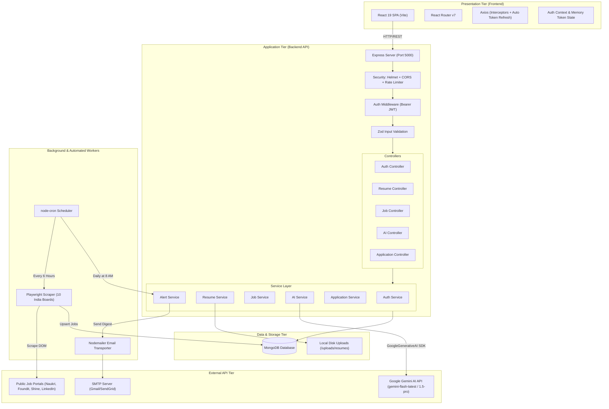
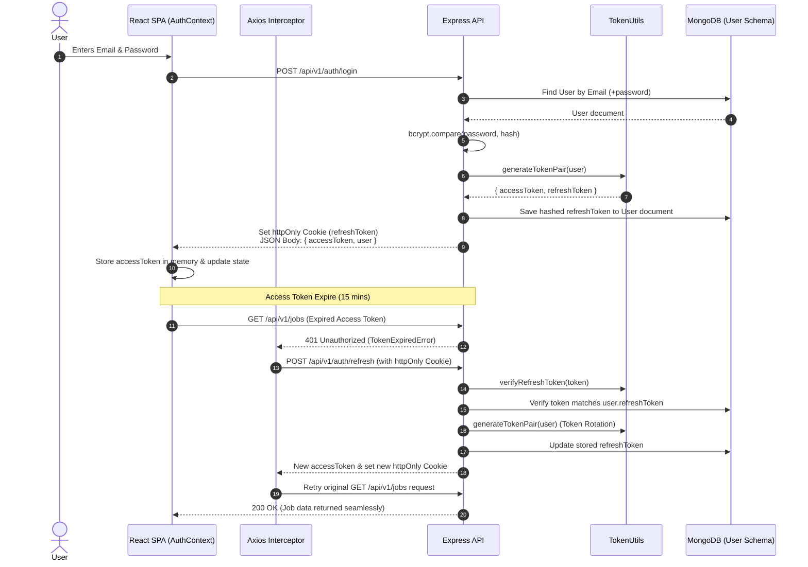
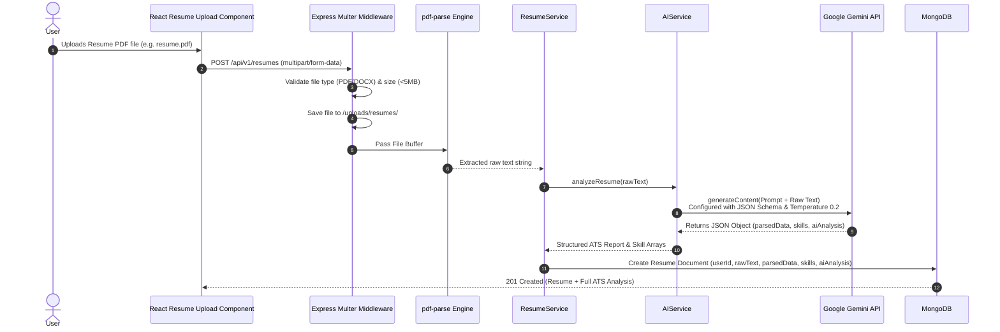
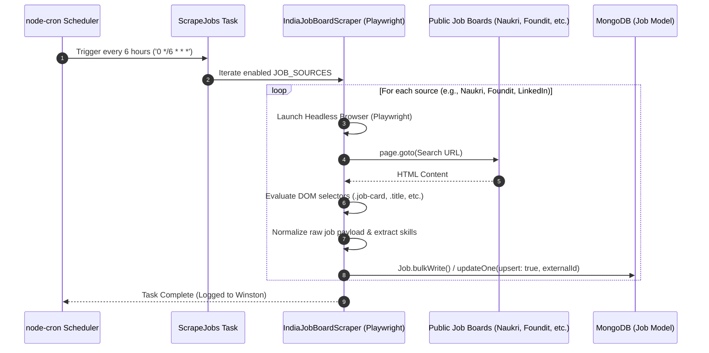

# 03. System Architecture — CareerPilot AI

## 1. High-Level Architecture Overview

CareerPilot AI follows a **Three-Tier Service-Oriented Monolith** pattern. The system isolates client presentation, API processing/business logic, background automation, and persistent data storage while maintaining deployment simplicity.

---

## 2. Detailed Data Flow Architecture

### Client → Server → Database Interaction Flow

1. **Request Dispatch**: The React frontend triggers an asynchronous API call via the custom `axiosInstance`.
2. **Security & Interception**:
   - Helmet injects secure HTTP headers (`X-Frame-Options`, `X-Content-Type-Options`, etc.).
   - CORS middleware verifies origin (`http://localhost:5173`).
   - Rate limiting middleware restricts client IP requests (100 req / 15 mins).
3. **Authentication Verification**: `authMiddleware.js` extracts the `Bearer <token>` from headers, decodes the JWT using `JWT_ACCESS_SECRET`, and fetches the corresponding User object from MongoDB.
4. **Validation**: Zod schema middleware verifies request payload schemas.
5. **Business Logic Execution**: Controller delegates execution to the dedicated Service class (`authService`, `resumeService`, `aiService`, etc.).
6. **Persistence**: Service interacts with Mongoose ODM models to perform CRUD operations on MongoDB.
7. **Response Serialization**: Mongoose `toJSON` transforms strip sensitive keys (`password`, `refreshToken`, `__v`) before returning a unified JSON envelope: `{ success: true, data: { ... } }`.

---

## 3. Key Subsystem Sequence Diagrams

### 3.1 Authentication & Token Refresh Flow

---

### 3.2 Resume Upload, PDF Parsing & AI ATS Analysis Flow

---

### 3.3 Automated Web Scraping & Background Processing Flow

---

## 4. Architectural Trade-offs & Decisions

1. **Service-Oriented Monolith vs. Microservices**:
   - *Decision*: Built as a unified Node.js monolith with distinct modular boundaries (`controllers/`, `services/`, `jobs/`).
   - *Rationale*: Avoids distributed system complexity, network latency, and orchestration overhead for campus project deployment while maintaining high maintainability.
2. **In-Memory Access Tokens + httpOnly Refresh Cookies**:
   - *Decision*: Access tokens are stored purely in React memory state (not localStorage) to prevent Cross-Site Scripting (XSS) token theft. Long-lived refresh tokens reside in HttpOnly, SameSite cookies to protect against CSRF.
3. **Structured LLM JSON Generation**:
   - *Decision*: Configured Gemini API with `responseMimeType: 'application/json'` and low temperature (0.2) instead of freeform text generation.
   - *Rationale*: Guarantees zero downstream JSON parsing failures and deterministic model outputs.
