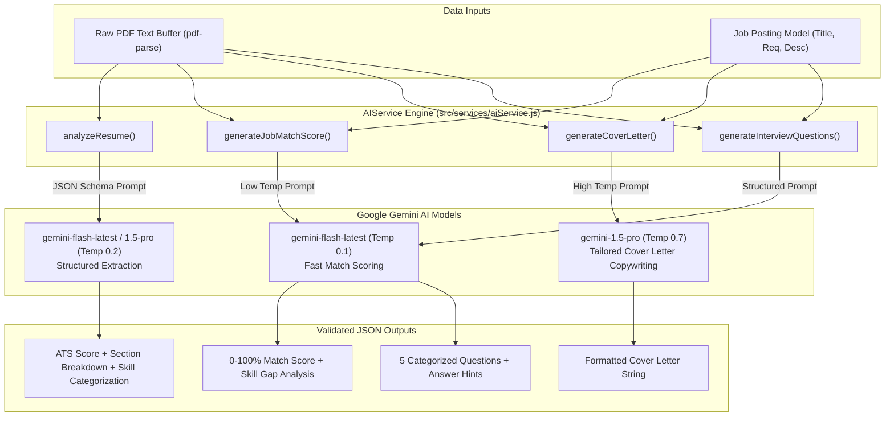

# 10. AI Subsystem & Prompt Engineering — CareerPilot AI

## 1. Overview & Provider Integration

CareerPilot AI integrates Google Gemini LLMs via the official `@google/generative-ai` SDK (`^0.24.1`). The system delegates document understanding, natural language synthesis, keyword extraction, and score evaluation to dedicated AI models based on task complexity.



---

## 2. Model Selection Strategy & Parameters

| Feature Module | Selected Model | Temperature | Response Format | Purpose / Rationale |
|---|---|---|---|---|
| **Resume ATS Analysis** | `gemini-flash-latest` | `0.2` | `application/json` | Low temperature ensures deterministic extraction of work experience, dates, and skills without hallucination. |
| **Job Match Scoring** | `gemini-flash-latest` | `0.1` | `application/json` | Fast inference model returning instant 0–100 match percentage and skill gap vectors. |
| **Cover Letter Generation** | `gemini-1.5-pro` | `0.7` | Plain Text / Markdown | Higher temperature allows creative phrasing while adhering to candidate experience parameters. |
| **Interview Question Prep** | `gemini-flash-latest` | `0.5` | `application/json` | Balanced temperature generating varied technical/behavioral questions tailored to target job roles. |

---

## 3. Prompt Engineering & JSON Schema Enforcement

To prevent LLM response parsing errors, prompts instruct the model using strict JSON schema contracts and explicit configuration parameters (`responseMimeType: 'application/json'`).

### 3.1 Resume ATS Extraction Prompt (Excerpt from `aiService.js`)
```typescript
const prompt = `
You are an expert ATS (Applicant Tracking System) parser and career coach.
Extract structured information and provide a detailed analysis of the following resume text.

RESPOND EXACTLY WITH THIS JSON SCHEMA (no markdown wrapping, just valid JSON):
{
  "parsedData": {
    "name": "Full Name or empty string",
    "email": "Email address or empty string",
    "experience": [{ "title": "Job Title", "company": "Company Name", "description": "Summary" }],
    "education": [{ "degree": "Degree earned", "institution": "School Name" }]
  },
  "skills": {
    "technical": ["Skill 1"],
    "soft": ["Skill 1"],
    "tools": ["Tool 1"],
    "languages": ["Lang 1"]
  },
  "aiAnalysis": {
    "overallScore": number (0-100),
    "atsScore": number (0-100),
    "sections": {
      "summary": { "score": number, "feedback": "Detailed feedback" },
      "experience": { "score": number, "feedback": "Detailed feedback" }
    },
    "strengths": ["Strength 1"],
    "improvements": ["Improvement 1"],
    "keywords": { "present": ["Keyword 1"], "missing": ["Keyword 1"] }
  }
}

--- RESUME TEXT ---
${rawText}
`;
```

---

## 4. Robust Response Parsing & Error Fallbacks

LLMs sometimes prefix JSON responses with markdown code fence wrappers (```json ... ```). `aiService.js` incorporates a robust parsing utility function `safeJsonParse`:

```javascript
const safeJsonParse = (text) => {
  try {
    // Strip triple backticks and markdown formatting
    const cleanText = text.replace(/^```(json)?\n?/i, '').replace(/\n?```$/i, '').trim();
    return JSON.parse(cleanText);
  } catch (err) {
    throw new Error('Failed to parse AI response as JSON: ' + err.message);
  }
};
```

### Operational Resilience & Fallbacks
- **API Key Guard**: `getAiInstance()` verifies presence of `GEMINI_API_KEY` before dispatching calls, throwing an operational `AppError(500)` if missing.
- **Quota & Timeout Handling**: Express rate limiters protect the server from breaching Gemini API tier limits. If Gemini returns an error, the service catches the exception and logs detailed trace logs via Winston before raising standard error responses to the UI.
