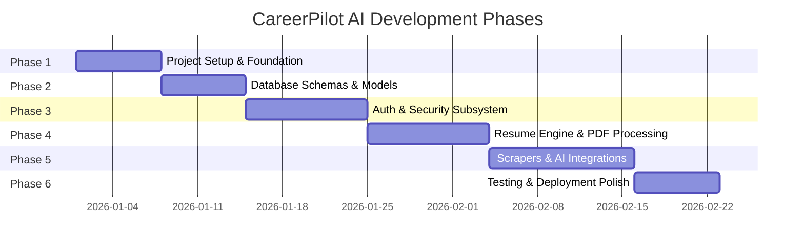

# 11. Implementation Plan & Phase History — CareerPilot AI

## 1. Step-by-Step Development Roadmap

The construction of CareerPilot AI was structured into 6 incremental development phases, progressing from core infrastructure to advanced AI and automation integrations.

---

## 2. Phase Breakdown & Key Artifacts

### Phase 1 — Project Setup & Monorepo Foundation
- **Goal**: Establish monorepo structure, script configuration, and environment setup.
- **Key Implementation Deliverables**:
  - Configured root `package.json` with `concurrently` to run backend (`server/`) and frontend (`client/`) concurrently via `npm run dev`.
  - Configured Express server pipeline in `server/src/app.js` with Helmet security headers, CORS policies (`corsOptions`), Morgan HTTP loggers, and express rate limiters.
  - Setup Vite + React 19 SPA shell with React Router DOM v7 and Tailwind CSS v4 styling rules.
- **Rationale**: Early establishment of environment configurations (`.env.example`) and code standards prevented dependency mismatches later in development.

---

### Phase 2 — Database Schemas & Data Layer
- **Goal**: Model application domain entities and establish persistent MongoDB connectivity via Mongoose.
- **Key Implementation Deliverables**:
  - Implemented `connectDB()` in `server/src/config/db.js` featuring retry logic and connection event monitoring.
  - Created 7 core Mongoose models: `User`, `Resume`, `Job`, `Application`, `Alert`, `CoverLetter`, `InterviewPrep`.
  - Defined explicit database indexes: unique index on `User.email`, compound index on `{ externalId: 1, source: 1 }` for `Job`, and TTL index on `Job.expiresAt` (7-day cleanup).
- **Rationale**: Defining strict schema validation rules at the Mongoose layer guaranteed data integrity across background worker scripts and controller methods.

---

### Phase 3 — Authentication & Security Subsystem
- **Goal**: Implement stateless JWT authentication featuring dual-token rotation and HttpOnly refresh cookies.
- **Key Implementation Deliverables**:
  - Built `tokenUtils.js` to sign 15-minute access tokens and 7-day refresh tokens using `jsonwebtoken`.
  - Created `userSchema.pre('save')` hook to automatically salt and hash passwords via `bcryptjs` (12 salt rounds).
  - Built `authMiddleware.protect` to extract Bearer headers, decode JWTs, and inject `req.user`.
  - Developed frontend `AuthContext.jsx` and `ProtectedRoute.jsx` to secure React view routes.
- **Rationale**: Storing access tokens exclusively in Javascript memory while holding refresh tokens in HttpOnly cookies provides optimal defense against both XSS and CSRF.

---

### Phase 4 — Resume Engine & PDF Parsing
- **Goal**: Allow candidates to upload resume PDF files, extract raw text, and persist structured resumes.
- **Key Implementation Deliverables**:
  - Configured Multer upload middleware (`src/middleware/upload.js`) to restrict uploads to PDF/DOCX format under 5MB.
  - Integrated `pdf-parse` to extract plain text string buffers from uploaded files.
  - Created `Resume` CRUD service routines and UI upload page (`ResumeUpload.jsx`).

---

### Phase 5 — Web Scraping & Gemini AI Subsystem
- **Goal**: Automate job aggregation and power AI career tools.
- **Key Implementation Deliverables**:
  - Implemented `IndiaJobBoardScraper` using Playwright headless browser to aggregate listings from 10 Indian job portals (Naukri, Foundit, Shine, LinkedIn India, etc.).
  - Configured `node-cron` in `scheduler.js` to run job scrapers every 6 hours (`0 */6 * * *`) and email alert digests daily at 8 AM (`0 8 * * *`).
  - Integrated Google Gemini AI (`@google/generative-ai` SDK) with structured JSON Schema prompts (`responseMimeType: 'application/json'`).
  - Built AI endpoints for ATS resume scoring, job match percentage calculation, cover letter drafting, and mock interview question generation.

---

### Phase 6 — Testing & Deployment Readiness
- **Goal**: System hardening, error boundary verification, and containerization.
- **Key Implementation Deliverables**:
  - Standardized operational error handling via `AppError.js` and global `errorHandler.js`.
  - Implemented Docker containerization setup using `docker-compose.yml` linking Node API and MongoDB services.
  - Created comprehensive documentation suite under `/docs` for campus placement presentation.
