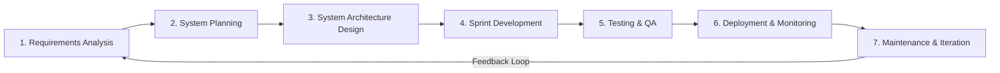
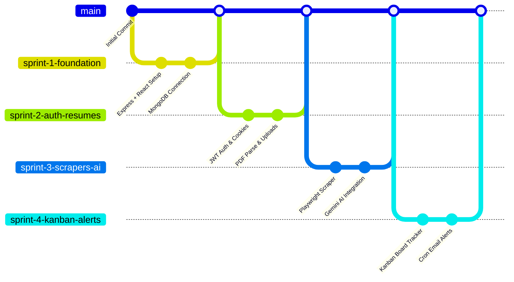

# 12. Software Methodology — CareerPilot AI

## 1. SDLC Methodology Framework

CareerPilot AI was engineered following the **Software Development Life Cycle (SDLC)** framework combined with **Agile/Scrum** iterative practices. This methodology ensured rapid feedback loops, modular software construction, and high code quality.

---

## 2. SDLC Phase Breakdown

### 1. Requirements Analysis
- Conducted user research with engineering students and job applicants to identify friction points in campus placement preparation.
- Defined functional requirements (PDF parsing, ATS scoring, job scraping, Kanban tracking) and non-functional requirements (sub-2 second API response latency, sub-500ms database index lookups, zero plaintext password persistence).

### 2. System Planning
- Designed the 3-tier architecture separating React frontend, Express API gateway, and MongoDB database.
- Created `implementation_plan.md` to map dependencies, third-party libraries (`@google/generative-ai`, `playwright`, `zod`, `jsonwebtoken`), and file directory organization.

### 3. System Architecture & Database Design
- Formulated Mongoose ODM schemas (`User`, `Resume`, `Job`, `Application`, `Alert`, `CoverLetter`, `InterviewPrep`).
- Defined index strategies (Compound Unique, Text Search, TTL Indexes).
- Established security policies (JWT dual-token rotation, HttpOnly refresh cookies, CORS, Rate limiting).

### 4. Development (Iterative Agile Sprints)
- Executed development across 2-week Agile sprints.
- Implemented Controller-Service-Model design pattern on backend and Component-Local/Global Context pattern on frontend.

### 5. Testing & Quality Assurance
- Conducted functional validation, security boundary testing (expired JWTs, SQL/NoSQL injection prevention), and manual endpoint verification via Postman.
- Verified AI output stability against varying resume layouts.

### 6. Deployment & Containerization
- Prepared Docker container configurations (`docker-compose.yml`) containing Node.js API runtime environment and MongoDB persistence containers.

### 7. Maintenance & Operations
- Configured automated background scrapers and cron jobs to fetch fresh job postings every 6 hours and purge expired records after 7 days.

---

## 3. Agile Sprint Structure

| Sprint | Duration | Focus Area | Deliverables |
|---|---|---|---|
| **Sprint 1** | Week 1–2 | Monorepo Setup & Core Infra | Express server setup, Vite React initialization, Tailwind CSS, MongoDB connection. |
| **Sprint 2** | Week 3–4 | Auth & Resume Subsystem | User registration/login, JWT tokens, bcrypt password hashing, PDF upload & text extraction. |
| **Sprint 3** | Week 5–6 | Web Scraping & Gemini AI | Playwright job scrapers (10 India job portals), Gemini ATS resume parsing & job matching. |
| **Sprint 4** | Week 7–8 | Kanban Tracker & Email Alerts | Interactive application status Kanban board, node-cron daily email alert engine. |
| **Sprint 5** | Week 9–10 | Optimization & Placement Docs | Security hardening, Docker setup, and final placement documentation suite (`/docs`). |
